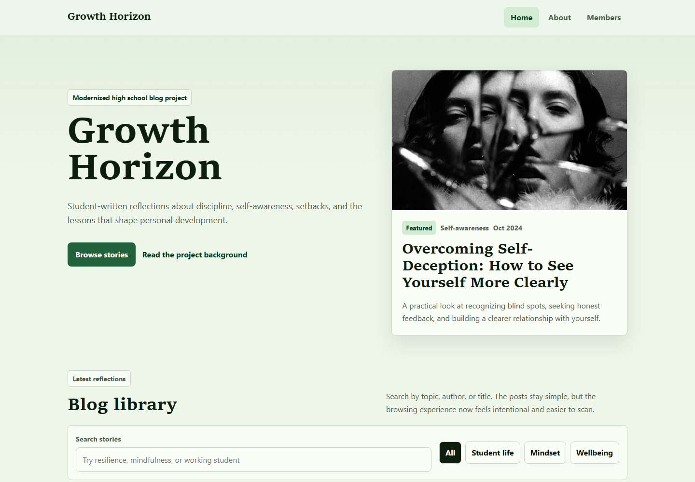
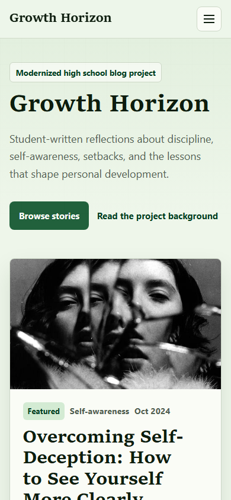
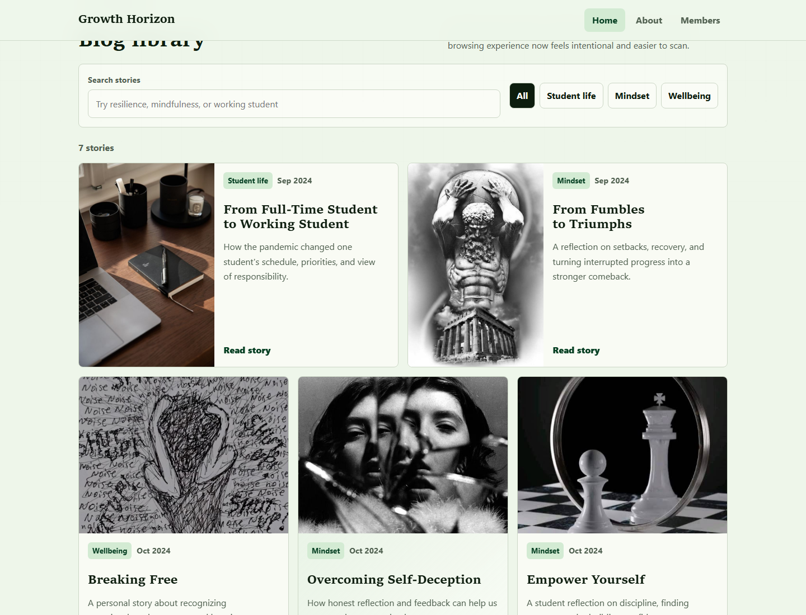
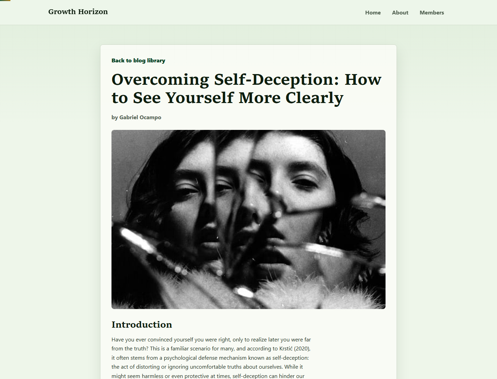
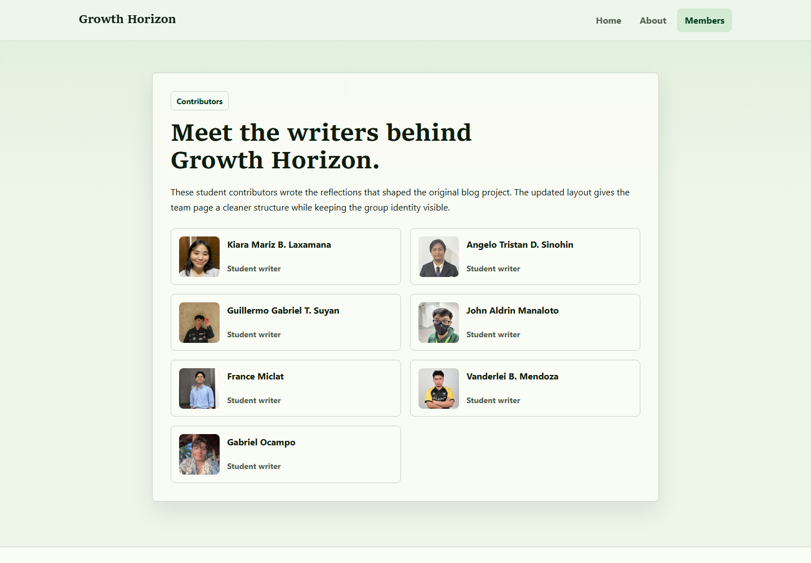

# Growth Horizon

Growth Horizon is a modernized static blog originally created as a high school Technical Writing project. The original site collected student reflections about personal growth, self-awareness, resilience, mindfulness, and working student life. This version keeps that concept intact while improving the interface, accessibility, responsiveness, and code organization so the project can be shown in a developer portfolio.

## Background

This project began as a school assignment with a simple goal: publish a group blog online. The portfolio version reframes it as a small, maintainable static website that demonstrates practical frontend improvement work: auditing an older codebase, removing outdated dependencies, improving semantic HTML, and polishing the user experience without overengineering the result.

## Before And After

Before:

- Repeated Bootstrap-era markup across every page
- Separate page-specific CSS files with duplicated styles
- Weak mobile behavior and uneven spacing
- Generic dark theme, vague links, and placeholder image alt text
- No README or portfolio framing

After:

- Static HTML, CSS, and JavaScript with no framework dependency
- Consolidated design system in one stylesheet
- Responsive editorial homepage with featured post, search, and category filtering
- Improved article pages with readable layout and reading progress
- Accessible navigation, skip link, visible focus states, descriptive links, and better alt text
- Portfolio-ready documentation and project context files

## Features

- Branded homepage for the Growth Horizon blog
- Featured article section
- Search and category filtering for the blog library
- Empty state when no posts match the current search/filter
- Individual article pages with reading progress indicators
- Contributors page for the original student writers
- About page explaining the modernization work
- Keyboard-friendly mobile navigation with Escape-key close support
- Reduced-motion support for users who prefer less animation

## Tech Stack

- HTML5
- CSS3
- Vanilla JavaScript

There is no backend, database, authentication, CMS, payment system, API integration, or build step.

## Folder Structure

```text
.
|-- assets/              # Images used by blog and member pages
|-- css/
|   `-- style.css        # Shared responsive styles and design tokens
|-- js/
|   `-- site.js          # Mobile navigation, filtering, and reading progress
|-- Documentation/       # Original project documentation and portfolio screenshots
|   `-- portfolio-screenshots/
|-- index.html           # Homepage and blog library
|-- about.html           # Project background
|-- members.html         # Contributor page
|-- main-post.html       # Featured post
|-- post1.html ... post6.html
|-- PRODUCT.md           # Product scope and purpose
|-- DESIGN.md            # Design direction and UI principles
|-- .gitattributes       # Line-ending normalization for cleaner diffs
`-- README.md
```

## Run Locally

Because this is a static site, you can open `index.html` directly in a browser.

For a local server, run:

```bash
python -m http.server 8000
```

Then visit:

```text
http://localhost:8000
```

## Design Improvements

- Replaced the old generic dark theme with a restrained editorial palette
- Added reusable CSS tokens for color, typography, spacing, shadows, and motion
- Improved visual hierarchy on the homepage and article pages
- Reworked the blog listing into a more intentional responsive layout
- Removed unused Bootstrap and jQuery dependencies
- Consolidated duplicated page-specific styles into `css/style.css`
- Added browser fallbacks for the OKLCH-based color system

## Accessibility Improvements

- Semantic landmarks: `nav`, `main`, `section`, `article`, `aside`, and `footer`
- Skip link for keyboard users
- Visible focus states for links, buttons, and inputs
- Descriptive image alt text
- Descriptive link text instead of vague "Click Here" labels
- `aria-current` for active navigation links
- `aria-live` for the filtered post count
- Reduced-motion handling for transitions and animations
- Keyboard-friendly mobile menu behavior

## Screenshots

These screenshots were captured locally from the static site.

| View | Preview |
| --- | --- |
| Desktop homepage |  |
| Mobile homepage |  |
| Blog listing |  |
| Article page |  |
| Members page |  |

## Deployment

### GitHub Pages

1. Push the repository to GitHub.
2. Open the repository settings.
3. Go to **Pages**.
4. Set the source to the main branch and root folder.
5. Save and wait for GitHub Pages to publish the site.

### Netlify

1. Create a new Netlify site from the Git repository.
2. Leave the build command empty.
3. Set the publish directory to the repository root.
4. Deploy.

### Vercel

1. Import the Git repository into Vercel.
2. Keep the project as a static site.
3. Leave the build command empty.
4. Set the output directory to the repository root if prompted.
5. Deploy.

## Portfolio Case Study

Growth Horizon is a modernized version of an old high school blog project. The goal was to preserve the original concept while upgrading the design, responsiveness, accessibility, navigation, content structure, and documentation so it could stand as a polished portfolio project.

| Area | Summary |
| --- | --- |
| Project background | The original site was built for a school Technical Writing subject and collected student essays about personal growth. |
| Original problem | The project had outdated styling, repeated markup, weak mobile behavior, unclear portfolio framing, and limited browsing support. |
| Modernization goal | Keep the static blog simple while making it feel intentional, readable, maintainable, and credible in a developer portfolio. |
| Design improvements | Rebuilt the visual system around calmer colors, stronger typography, responsive editorial layouts, better spacing, and clearer hierarchy. |
| Code improvements | Removed old Bootstrap and jQuery dependencies, consolidated styles, added small vanilla JavaScript enhancements, and cleaned local references. |
| Accessibility improvements | Added semantic landmarks, skip links, focus states, descriptive alt text, active navigation state, reduced-motion handling, and clearer link labels. |
| Static-site constraints | No backend, database, CMS, authentication, build step, paid service, or deployment-specific configuration was added. |
| What I learned | A small student project can become portfolio-ready through focused refactoring, design judgment, documentation, and accessibility work without overengineering it. |
| Possible future improvements | Add original photography, a custom 404 page, and a longer redesign write-up if the project becomes part of a full portfolio case study. |

## Future Improvements

- Replace sourced images with original photography or custom graphics
- Add the portfolio screenshots listed above
- Add a simple custom 404 page for static hosting
- Consider a lightweight static-site generator only if the number of posts grows
- Write a short case study page describing the redesign process
